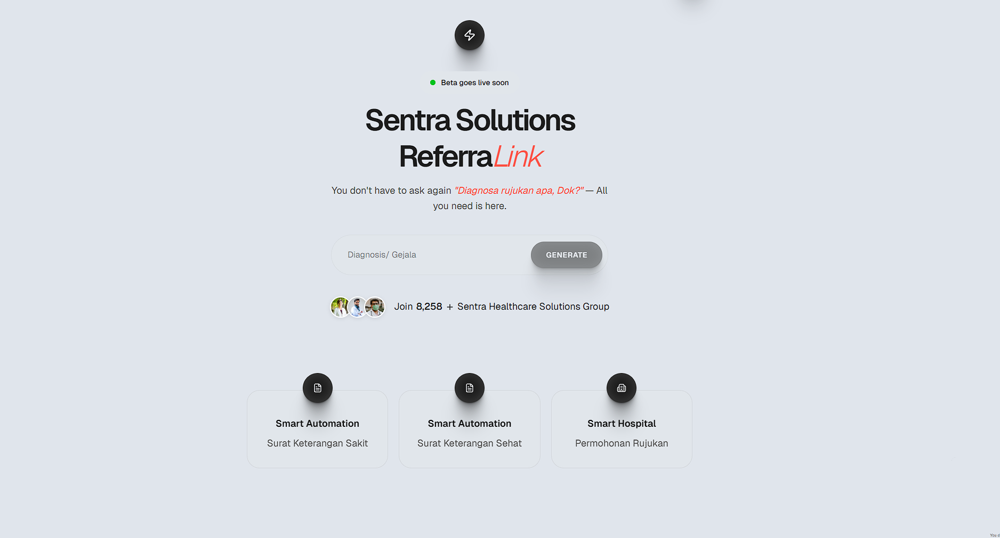

<div align="center">


# 🔗 Referralink

### An AI-Powered Referral Management Platform

**Empowering teams to streamline referrals, gain insights, and grow together.**

[](LICENSE)
[](package.json)
[](package.json)
[](package.json)
[](package.json)

</div>

---

## 📋 Table of Contents

- [Introduction](#introduction)
- [Features](#features)
- [Screenshots](#screenshots)
- [System Requirements](#system-requirements)
- [Installation](#installation)
- [Usage](#usage)
- [Project Structure](#project-structure)
- [Contributing](#contributing)
- [Acknowledgments](#acknowledgments)
- [Support](#support)
- [License](#license)

---

## 🙏 Introduction

Referralink is a modern, AI-enhanced referral management platform built with the humble goal of making referral tracking simple, insightful, and accessible to everyone. We believe great products are built collaboratively, and we're grateful for your interest in joining us on this journey.

### Our Purpose

In today's fast-paced business environment, managing referrals shouldn't be complicated. We've created Referralink to help you:

- **Track referrals effortlessly** with real-time visibility into your referral pipeline
- **Gain actionable insights** powered by cutting-edge AI analysis
- **Make data-driven decisions** with clear metrics and visualizations
- **Streamline collaboration** across your team with an intuitive interface
- **Export professional reports** to share insights with stakeholders

### What Makes Us Different

Rather than overwhelming you with complexity, we've focused on:
- **Simplicity first** - An intuitive interface that requires minimal learning curve
- **AI-powered insights** - Intelligent analysis without requiring technical expertise
- **Beautiful design** - A responsive, modern interface that works everywhere
- **Open development** - Built in the open, with community contributions welcome

We're grateful for your patience as we continue to improve and expand Referralink's capabilities.

---

## ✨ Features

At the heart of Referralink, you'll find:

| Feature | Description |
|---------|-------------|
| 🤖 **AI-Powered Analysis** | Intelligent insights generated from your referral data |
| 📊 **Real-time Dashboard** | Monitor key metrics and referral trends at a glance |
| 📈 **Comprehensive Tracking** | Full visibility into your referral pipeline |
| 📄 **PDF Export** | Generate professional reports in seconds |
| 📱 **Responsive Design** | Seamless experience on desktop, tablet, and mobile |
| ⚙️ **Multi-AI Integration** | Support for Gemini, DeepSeek, and other AI services |
| 🎨 **Modern UI Components** | Material Design elements and custom components |
| 🔒 **Type-Safe Development** | Full TypeScript support for reliability |

---

## 📸 Screenshots

<div align="center">

<br/>
<em>The intuitive Referralink dashboard showcasing real-time metrics and AI insights</em>
</div>

---

## 🛠️ System Requirements

Before you begin, please ensure you have the following installed:

### Prerequisites

- **Node.js** 16.x or higher (18+ is recommended for better performance)
- **npm** 8.x or higher, or **pnpm** 8.x+
- **Git** for version control
- A valid API key for AI services:
  - [Google Gemini API](https://ai.google.dev/) (recommended)
  - [DeepSeek API](https://www.deepseek.com/) (optional)

### Verify Your Installation

```bash
# Check Node.js version
node --version        # Should be 16.0.0 or higher

# Check npm version
npm --version         # Should be 8.0.0 or higher
```

---

## 📦 Installation

We've kept the installation process straightforward. Follow these steps to get Referralink running locally:

### Step 1: Clone the Repository

```bash
git clone https://github.com/DocSynapse/Referralink.git
cd Referralink
```

### Step 2: Install Dependencies

Choose your preferred package manager:

```bash
# Using npm (recommended)
npm install

# Or using pnpm
pnpm install

# Or using yarn
yarn install
```

**Tip**: We recommend `pnpm` for faster installation and better disk space efficiency.

### Step 3: Configure Environment Variables

```bash
# Copy the example environment file
cp .env.example .env.local
```

Open `.env.local` and add your API credentials:

```env
# Gemini API Configuration (recommended)
VITE_GEMINI_API_KEY=your_gemini_api_key_here

# DeepSeek Configuration (optional)
VITE_DEEPSEEK_API_KEY=your_deepseek_api_key_here
VITE_DEEPSEEK_API_URL=https://api.deepseek.com/v1

# API Settings
VITE_API_TIMEOUT=30000
```

**How to get API keys:**
- **Gemini**: Visit [Google AI Studio](https://ai.google.dev/) and create a new API key
- **DeepSeek**: Sign up at [DeepSeek](https://www.deepseek.com/) and generate an API key

### Step 4: Start the Development Server

```bash
npm run dev
```

Your application is now running! Open your browser and visit:

```
http://localhost:5173
```

### Step 5 (Optional): Build for Production

When you're ready to deploy:

```bash
# Create an optimized production build
npm run build

# Preview the production build locally
npm run preview
```

The optimized files will be in the `dist/` directory.

---

## 🎮 Usage

### Getting Started

Once you've installed Referralink, here's how to make the most of it:

#### Basic Workflow

1. **Access the Application**
   - Open http://localhost:5173 in your web browser
   - You'll see the welcome portal with platform selection

2. **Input Your Data**
   - Use the intuitive form to add referral information
   - Fields include referrer details, referee information, and referral status

3. **Leverage AI Analysis**
   - Click on AI analysis features to gain insights
   - Referralink will analyze your data and provide actionable recommendations
   - Review detailed metrics and trend analysis

4. **Export Results**
   - Generate professional PDF reports with one click
   - Share insights with your team and stakeholders
   - Track historical data for trend analysis

5. **Monitor Metrics**
   - Check the real-time dashboard for key performance indicators
   - Monitor conversion rates, active referrals, and success metrics

### Common Commands

```bash
# Development
npm run dev              # Start dev server with hot reload

# Production
npm run build            # Build for production
npm run preview          # Preview production build

# Code Quality
npx tsc --noEmit       # Type check your code
```

### Usage Tips & Best Practices

#### 🎯 For Best Results:

- **Keep data clean**: Ensure referral information is accurate and complete
- **Regular analysis**: Run AI analysis weekly to identify trends early
- **Use exports wisely**: Export reports for important milestones or stakeholder updates
- **Mobile access**: Check metrics on-the-go using our responsive mobile interface
- **API management**: Monitor your API usage to avoid unexpected quota limits

#### 📝 Data Entry Tips:

- **Consistency matters**: Use consistent naming and categorization for better AI insights
- **Complete profiles**: Fill in optional fields when possible for richer analysis
- **Regular updates**: Keep referral statuses current for accurate tracking

#### 🚀 Performance Optimization:

- Use the browser's localStorage features to cache frequently accessed data
- Limit real-time updates to critical metrics during heavy usage
- Consider exporting historical data periodically for backup

### Example Workflow

Here's a typical use case:

```
Week 1: Enter 10 new referrals from your sales team
        Run AI analysis to identify patterns
        Export summary report for manager

Week 2: Monitor conversion metrics on the dashboard
        Add new referrals from successful conversions
        Export updated report with new insights

Week 3: Analyze trends using AI to identify top performers
        Share insights with the team for optimization
        Plan strategy based on data-driven recommendations
```

---

## 📁 Project Structure

We've organized the codebase for clarity and maintainability:

```
Referralink/
├── components/              # Reusable React components
│   ├── Dashboard.tsx        # Main dashboard component
│   ├── AIAnalysis.tsx       # AI-powered analysis UI
│   ├── DataInput.tsx        # Data entry forms
│   └── ...
├── services/                # Business logic & API services
│   ├── geminiService.ts     # Gemini API integration
│   ├── deepseekService.ts   # DeepSeek API integration
│   ├── exportService.ts     # PDF export functionality
│   └── ...
├── lib/                      # Utility functions and helpers
│   ├── formatters.ts        # Data formatting utilities
│   ├── validators.ts        # Input validation
│   └── ...
├── types.ts                  # TypeScript type definitions
├── constants.ts              # Application constants
├── App.tsx                   # Root component
├── index.tsx                 # React entry point
├── index.css                 # Global styles
├── public/                   # Static assets (images, icons)
├── docs/                     # Additional documentation
├── .github/                  # GitHub workflows and templates
├── package.json              # Dependencies and scripts
└── vite.config.ts           # Build configuration
```

---

## 🤝 Contributing

We're deeply grateful for your interest in contributing to Referralink! Whether you're fixing a bug, adding a feature, or improving documentation, your contribution matters.

### We Welcome:

- 🐛 **Bug reports** - Help us identify and fix issues
- ✨ **Feature suggestions** - Share your ideas for improvement
- 📝 **Documentation improvements** - Help others understand the project
- 🔧 **Code contributions** - Implement features or fixes
- 🎨 **Design suggestions** - Help us improve the user experience

### How to Contribute

#### Reporting Issues

1. Check existing issues to avoid duplicates
2. Open a new issue with:
   - Clear title describing the problem
   - Detailed description and steps to reproduce
   - Expected vs. actual behavior
   - Your environment (OS, Node version, browser, etc.)
   - Screenshots if applicable

#### Submitting Pull Requests

We use a simple pull request workflow:

1. **Fork the repository**
   ```bash
   # Click "Fork" on GitHub
   ```

2. **Create a feature branch**
   ```bash
   git checkout -b feature/your-feature-name
   # or for bug fixes
   git checkout -b fix/bug-description
   ```

3. **Make your changes**
   - Follow our coding standards (see below)
   - Keep commits focused and atomic
   - Add tests if applicable
   - Update documentation as needed

4. **Commit with clear messages**
   ```bash
   git commit -m "feat(scope): description of changes"
   ```

   We follow [Conventional Commits](https://www.conventionalcommits.org/):
   - `feat`: New feature
   - `fix`: Bug fix
   - `docs`: Documentation changes
   - `style`: Code style (formatting, missing semicolons, etc.)
   - `refactor`: Code refactoring
   - `perf`: Performance improvements
   - `test`: Adding or updating tests
   - `chore`: Maintenance tasks

5. **Push and create a Pull Request**
   ```bash
   git push origin feature/your-feature-name
   ```
   - Fill in the PR template with clear description
   - Link related issues
   - Describe testing performed

#### Coding Standards

**TypeScript/JavaScript:**
- Use TypeScript for type safety
- Prefer `const` over `let`, avoid `var`
- Use arrow functions for callbacks
- Write meaningful variable names
- Keep functions focused and single-responsibility

**React Components:**
```typescript
interface MyComponentProps {
  title: string;
  onClose?: () => void;
}

export const MyComponent: React.FC<MyComponentProps> = ({
  title,
  onClose
}) => {
  return (
    <div className="p-4">
      <h2>{title}</h2>
      {onClose && <button onClick={onClose}>Close</button>}
    </div>
  );
};
```

**Styling:**
- Use Tailwind CSS utility classes
- Keep custom CSS minimal
- Use semantic HTML
- Maintain responsive design

### Development Guidelines

- Keep pull requests focused and manageable (preferably under 400 lines of code)
- Write clear commit messages that explain the "why"
- Add comments only where logic isn't self-evident
- Test your changes thoroughly before submitting
- Update `CHANGELOG.md` for significant changes

### Code Review Process

1. **Submission**: You submit a pull request
2. **Review**: Team members review your code
3. **Feedback**: Address any feedback constructively
4. **Approval**: At least one maintainer approves
5. **Merge**: Your contribution is merged into main!

We appreciate patience during the review process and are committed to providing constructive, respectful feedback.

### Getting Help

- **Have questions?** Open an issue labeled `question`
- **Need guidance?** Comment on the issue you're working on
- **Found a security issue?** See [SECURITY.md](SECURITY.md)
- **Want to discuss?** Start a discussion on GitHub

---

## 🙌 Acknowledgments

Referralink stands on the shoulders of giants. We're deeply grateful for:

### Open Source Projects

- **[React](https://react.dev/)** - For the excellent UI framework
- **[Vite](https://vitejs.dev/)** - For fast, modern build tooling
- **[Tailwind CSS](https://tailwindcss.com/)** - For utility-first styling
- **[TypeScript](https://www.typescriptlang.org/)** - For type safety
- **[Material Web](https://github.com/material-components/material-web)** - For Material Design components
- **[Lucide React](https://lucide.dev/)** - For beautiful, consistent icons
- **[Framer Motion](https://www.framer.com/motion/)** - For smooth animations
- **[GSAP](https://greensock.com/gsap/)** - For advanced animation library
- **[jsPDF](https://github.com/parallax/jsPDF)** - For PDF generation
- **[OpenAI SDK](https://github.com/openai/node-sdk)** - For AI integration

### AI Services

- **[Google Gemini](https://ai.google.dev/)** - AI-powered insights and analysis
- **[DeepSeek](https://www.deepseek.com/)** - Alternative AI service integration

### Contributors

We want to thank everyone who has contributed time, ideas, and code to make Referralink better:

- The amazing open-source community
- Early adopters who provided feedback
- Contributors who've submitted code and documentation improvements
- Everyone who's reported bugs and suggested features

### Special Thanks

To everyone using Referralink: Your trust and feedback drive us to continuously improve. We're honored to be part of your growth journey.

---

## 📞 Support & Contact

We're here to help! Feel free to reach out:

### Getting Help

- **Issues & Bugs**: [GitHub Issues](https://github.com/DocSynapse/Referralink/issues)
- **Discussions**: [GitHub Discussions](https://github.com/DocSynapse/Referralink/discussions)
- **Security**: See [SECURITY.md](SECURITY.md) for reporting vulnerabilities
- **Email**: For inquiries, contact the maintainers

### Useful Resources

- [API Documentation](docs/API.md) - API endpoints and usage
- [Development Guide](docs/DEVELOPMENT.md) - Development setup and architecture
- [Troubleshooting](docs/TROUBLESHOOTING.md) - Common issues and solutions
- [Gemini Setup Guide](GEMINI.md) - Detailed Gemini API configuration
- [Contributing Guide](CONTRIBUTING.md) - Detailed contribution guidelines
- [Security Policy](SECURITY.md) - Security and vulnerability information
- [Changelog](CHANGELOG.md) - Version history and updates

---

## 📄 License

This project is licensed under the **MIT License**, which means:
- ✅ You can use it freely in personal and commercial projects
- ✅ You can modify the code
- ✅ You can distribute it
- ⚠️ You must include the license and copyright notice

See the [LICENSE](LICENSE) file for complete details.

---

## 🌟 Project Status

| Aspect | Status |
|--------|--------|
| **Current Version** | 0.1.0 (Beta) |
| **Development Status** | Active Development |
| **Last Updated** | January 2026 |
| **Node Support** | 16.x - 22.x |
| **React Support** | 19.2.1+ |

---

<div align="center">

### 🙏 Thank You!

Referralink is built with care and gratitude for our community.

Your ideas, contributions, and feedback make us better every day.

[⬆ Back to Top](#-referralink)

---

**Made with ❤️ by the Referralink Team**

*Building the future of referral management, together.*

</div>
